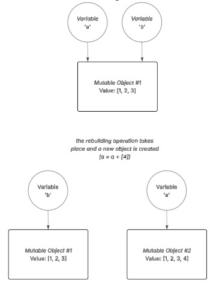

# Mutable, Immutable... everything is an object!
<i>Author: Anna Halaapiapi</i>  


## Introduction
In Python, <b>everything</b> (strings, integers, lists and so on...) is an object. Understanding how these objects behave, how variables reference them, how identity works, and the difference between mutable and immutable objects is essential for writing predictable code.

This 'blog post' will outline the core concepts of determining object identity and data type, mutability, immutability, aliasing, and how function arguments are handled in Python.

## id and type
### id()
- id() is a function that returns an object's identity.
- In CPython, an object's identity is the object's memory address and it will look something like this:
```python
>>> a = [1, 2, 3, 4]
>>> id(a)
132561636135360
```
- With id(), we can check whether two variables point to the same object in memory. This can be useful for debugging purposes. 
- In the below example, we use the comparison operator '==' which will return True if object a and object b have the same memory address, else will return False:
```python
>>> id(a) == id(b)
```
This is the same as doing this:
```python
>>> a is b
```
<b>But NOT the same as doing this:</b>
```python
>>> id(a) is id(b)
```
Why??  
Because...
- id() returns an object of the int class
- using 'is' compares if the objects are the same by comparing their memory addresses
- but you will be comparing the two int objects created by id(), not the intended objects a and b
- therefore to compare if objects a and b are the same object in memory when using id(), you should always use the comparison operator '==' and not 'is'.

### type()
- type() is a function that returns an object's data type and is useful for debugging purposes.
- In this example, we determine the data type (class) of object 'x':
```python
>>> x = 5
>>> print(type(x))

#Output: <class 'int'>
```

## Mutable objects
- Mutable objects in Python are objects whose value you can modify after they've been created.
- This means you can change the value of an existing object in memory without creating a new object.
- Examples of mutable objects: lists, dictionairies, sets and byte arrays
- If you create two mutable objects with the exact same values, it is important to know Python will always create two separate objects.
- <b>Important Note: </b>   
Performing mutating methods on mutable objects will modify the same object in memory.  
BUT operations that rebuild or reassign will create a new object in memory.
- In this example, we perform a mutating method 'append' on a list, and lists 'a' and 'b' will still point to the same list object:
```python
>>> a = [1, 2, 3]
>>> b = a
>>> a.append(4)
>>> print(b)

# Output: [1, 2, 3, 4]
```
In memory, this would look like:  


- In this example, we perform an operation that rebuilds list 'a', creating a new object in memory. List 'b' however will still point to the original list:
```python
>>> a = [1, 2, 3]
>>> b = a
>>> a = a + [4]
>>> print(b)

#Output: [1, 2, 3]
```
In memory, this would look like:  


## Immutable objects
- Immutable objects in Python are objects whose value you cannot modify after they've been created.
- This means you cannot change the value of an existing object in memory, you must create a new object instead.
- Examples of immutable objects: integers, floats, booleans, strings, tuples, bytes
- Python will often, <u>but not always</u>, reuse the same object in memory for immutable objects that contain identical values.
- In this example, we create a string and modify it. By modifying the value of the immutable object, we are creating a new object in memory with the modified value. We can confirm this by comparing the id of 'a' before and after the modification:
```python
>>> a = "Best"
>>> b = "School"
>>> id(a)
# Output: 123272576178800 <-- Original id
>>> a = a + " " + b
>>> id(a)
# Output: 123272576179888 <-- New id
>>> print(a)
# Output: Best School
```

## Why does it matter and how differently does Python treat mutable and immutable objects?
It is important to understand how mutable and immutable objects are handled in Python and in memory so that you do not inadvertently cause unintended behaviour in your code.  

For example, if you create an alias for a mutable object (i.e. create another variable that references the same object in memory) and then modify the original variable, you will also be modifying the same underlying object. This means that the aliased variable will reflect those changes, even if you didn't intend for it to do so.  

On a similar note, immutable objects behave differently because they can't be changed in place as we saw earlier. If you 'modify' an immutable object, Python creates a new object in memory and the original remains unchanged. This means aliasing is safe for immutable objects, since no variable can accidentally change the value of another.

## How arguments are passed to functions and what does that imply for mutable and immutable objects?
In Python, arguments are passed to functions using a mechanism called 'pass by assignment'. This means the function gets a reference to the original object in memory, not a copy. The function creates its own new local variable that points to the same object that was passed in.

As functions receive a reference to the original object, this implies that underlying mutable objects can be changed within a function, whereas underlying immutable objects cannot be changed within a function.

- In this example, we pass the variable that references a mutable object in memory to a function. The function modifies the same list object in memory:
```python
>>> a = [1, 2, 3]
def change_me(x):
    return x.append(4)
>>> change_me(a)
>>> print(a)

# Output: [1, 2, 3, 4]
```
- In this example, we pass the variable that references an immutable object in memory to a function. The function can't change the value of the original object:
```python
>>> a = 89
def cant_change_me(x):
    x + 1
>>> cant_change_me(a)
>>> print(a)

# Output: 89
```

## Integer pre-allocation
- Integer pre-allocation refers to pre-allocating the first 262 integers when Python starts.
- This means all integers from -5 to 256 are created once, and then the same objects are reused throughout the program.
- This is done because smaller integers are more commonly used (in loops, counters etc.), therefore this is useful for saving memory and improving performance.
- Larger integers however may or may not be reused.
- Even though integers are immutable and <i>can</i> be reused, Python doesn't because caching every integer would waste memory and impact performance.
- In this example, 'a' and 'b' reference the same pre-allocated integer object, which is why a is b returns as True.
```python
>>> a = 2
>>> b = 2
>>> a is b

#Output: True
```

## NSMALLPOSINTS & NSMALLNEGINTS
